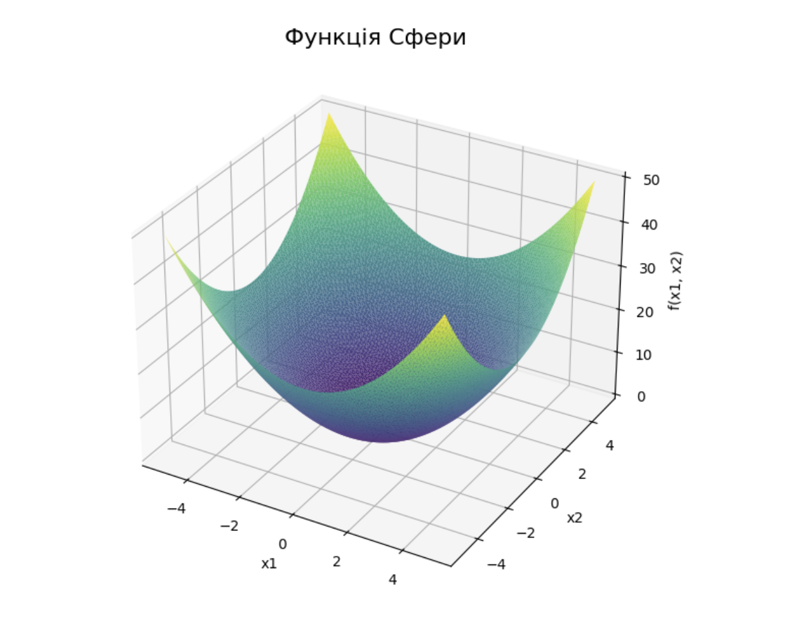
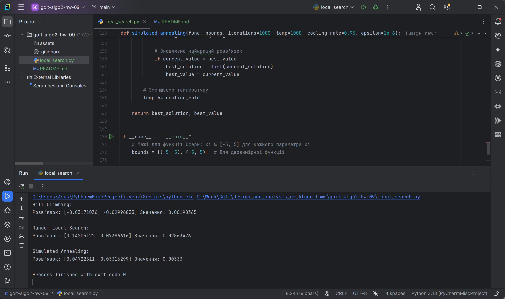

## Опис завдання

Реалізуйте програму для мінімізації функції Сфери `f ( x ) = ∑ i = 1 n x i 2`,
використовуючи три різні підходи до локальної оптимізації:

- Алгоритм «Підйом на гору» (Hill Climbing)
- Випадковий локальний пошук (Random Local Search)
- Імітацію відпалу (Simulated Annealing)



### Технічні умови

1. Межі функції визначаються як x i ∈ [ − 5 , 5 ] для кожного параметра x i.

2. Алгоритми повинні повертати оптимальну точку (список координат x) та значення
   функції в цій точці.

3. Реалізуйте три методи оптимізації:

- `hill_climbing` — алгоритм підйому на гору.
- `random_local_search` — випадковий локальний пошук.
- `simulated_annealing` — імітація відпалу.

4. Кожен алгоритм має приймати параметр `iterations`, який визначає максимальну
   кількість ітерацій для виконання алгоритму.

5. Алгоритми повинні завершувати виконання за однією з умов:

- Зміна значення цільової функції або положення точки в просторі розв'язків між
  двома послідовними ітераціями стає меншою за epsilon, де epsilon є параметром
  точності і визначає чутливість алгоритму до незначних покращень.
- Для алгоритму відпалу враховується температура: якщо температура зменшується
  до значення меншого за epsilon, алгоритм завершує виконання, оскільки це
  вказує на вичерпання пошукової здатності алгоритму.


### Шаблон програми

```python
import random import math

# Визначення функції Сфери

def sphere_function(x): return sum(xi ** 2 for xi in x)

# Hill Climbing

def hill_climbing(func, bounds, iterations=1000, epsilon=1e-6): pass

# Random Local Search

def random_local_search(func, bounds, iterations=1000, epsilon=1e-6): pass

# Simulated Annealing

def simulated_annealing(func, bounds, iterations=1000, temp=1000,
cooling_rate=0.95, epsilon=1e-6): pass

if **name** == "**main**":

# Межі для функції

bounds = [(-5, 5), (-5, 5)]

# Виконання алгоритмів

print("Hill Climbing:") hc_solution, hc_value = hill_climbing(sphere_function,
bounds) print("Розв'язок:", hc_solution, "Значення:", hc_value)

print("\nRandom Local Search:") rls_solution, rls_value =
random_local_search(sphere_function, bounds) print("Розв'язок:", rls_solution,
"Значення:", rls_value)

print("\nSimulated Annealing:") sa_solution, sa_value =
simulated_annealing(sphere_function, bounds) print("Розв'язок:", sa_solution,
"Значення:", sa_value)
```

### Приклад виконання

```bush
Hill Climbing: Розв'язок: [0.0005376968388007969, 0.0007843237077809137]
Значення: 9.042815690435702e-07

Random Local Search: Розв'язок: [0.030871215407484165, 0.10545563391334589]
Значення: 0.012073922664800917

Simulated Annealing: Розв'язок: [0.024585173708439823, -0.00484719941675793]
Значення: 0.0006279261084599791
```


### Результат виконаного ДЗ


